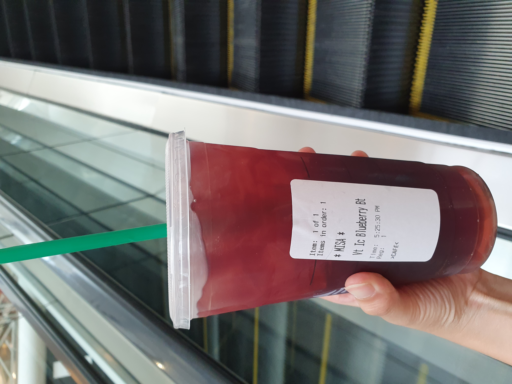

---

There are countless differences between the culture of my homeland and that of the United States, but if I were to pinpoint one distinctive aspect, it would be the norm surrounding the use of personal names. For instance, when waiting for an order of coffee or a sandwich, the person taking my order often asks for my name.

In East Asian culture, addressing someone by their first name can often be considered impolite, depending on the situation. If you've read the Three Kingdoms, which could perhaps be seen as the Asian equivalent of the Arthurian legends (although I'm not entirely sure since I'm only familiar with fragments of the story), you might have an inkling. Ancient East Asian nobles had several names, including one for infancy, childhood, and a formal name to be used in official settings, as a means to avoid using their real names. This complex regard for personal names in ancient times is something I don't fully grasp, but I sense that elements of this tradition linger in contemporary culture.

Anyway, I tend to use fictitious names at places like Starbucks. While my name is phonetically simple, Americans often struggle to understand it initially, and I lack the steadfast determination to ensure the barista gets it right every time. Actually, I find a certain amusement in providing obviously fake names that retain a semblance of anonymity. Occasionally, when asked for my name, I'm tempted to respond with a playful "Call me Ishmael." I haven't actually done this yet, primarily because I don't resemble an "Ishmael" in the slightest. Nonetheless, I think it would be a rather good joke, given that the narrator in the novel isn't actually Ishmael either; he merely suggests that others refer to him as such. I didn't finish the book but how can I forget this opening line?

There are several other books with opening lines of intense impression that have stayed with me, one being "The Communist Manifesto." In truth, I scarcely remember the contents, but that powerful opening sentence is unforgettable. I often reference it in conversations, but I always find myself adding, "I've read the book, but I'm not a communist." Although it's true that I'm not a communist, I can't shake the feeling that this recurring disclaimer feels somewhat superficial and pathetic. I harbor an ingrained, subconscious fear of anti-communist scrutiny. This deep-seated fear doesn't dissipate easily, even though I intellectually understand that no one will persecute me for potentially holding communist beliefs. (And I don't hold such belief, for sure.)

Whenever I find myself slightly apprehensive at the mention of communism or the Communist Party, the thought that follows is it is now hard to claim myself as one of the young generation. My childhood was overlapped with the tail end of the Cold War era. As a child, I grew up ingesting the crumbs of Anti-communism, which eventually has been ingrained in me. Although I caught only the tail of it, I lived the Cold War, and it was on the Korean Peninsula.

Similarly, there are other aspects that vividly illustrate my generation's experiences. When I think of the wealthiest individuals globally, I instinctively envision Bill Gates, followed shortly by Warren Buffet. Only after a few seconds do I realize that the richest people are no longer these figures. Bill Gates may not know me, but I kind of harbor a nostalgia for him. The first PC I used involved Windows 95 on it and didn't support hot plug, which means if a keyboard or a mouse got taken out accidentally, you had no choice but to reboot. Booting up that old machine took so long and I needed system permission of the OS to power off it. I even remember the moments such as the antitrust litigation for bundling Internet Explorer with their OS's. And it has been 10 years or so since the software support for that (in)famous Internet Explore stopped.

It has been a few years since I received the COVID vaccine, and I'm yet to see signs of Bill exerting control over me. Regardless, I remain hopeful that he'll soon take charge, crafting experiments and even writing papers on my behalf.
