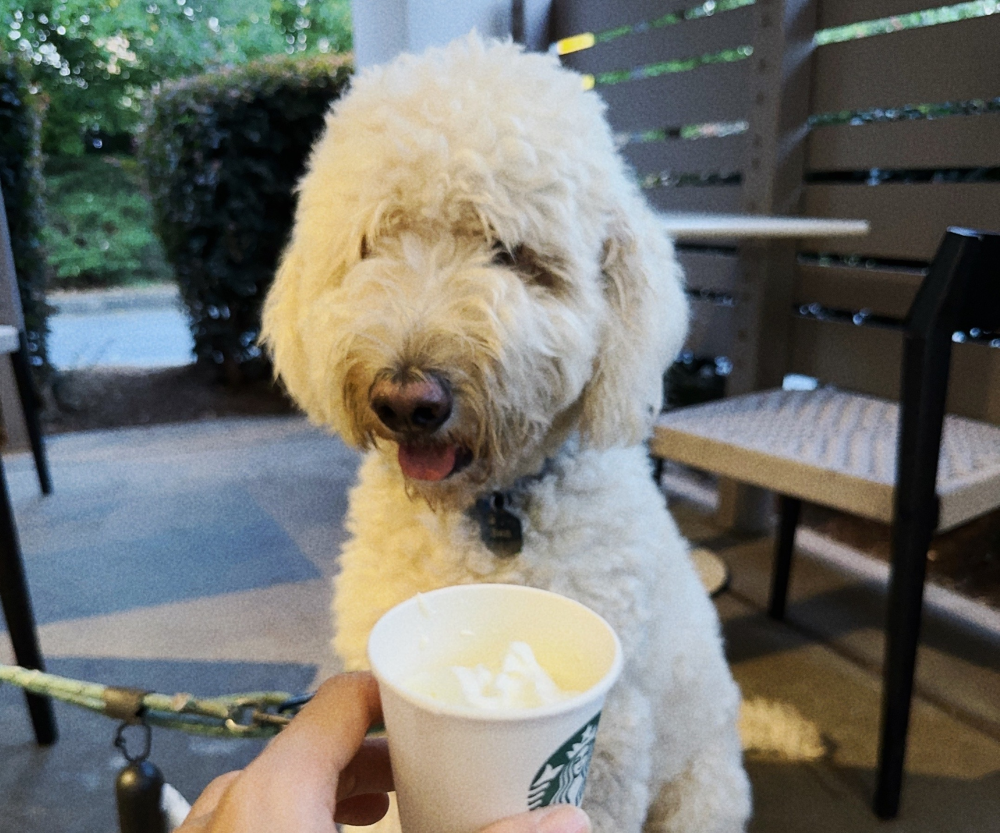

---

I observe a lot of farms merely an hour's drive away from Atlanta. Looking at them, I would think to myself that I wish to be born on a farm and live my whole life on farms. I picture a life with nothing but cattle, horses, and hay. Preferably, I wish I couldn't read in that life and I didn't possess any books. I dream of a life with a minimum of language. The more one talks, the more likely one is to lie. I wish for a life where I spend most of the day physically working, devoid of any lies.

Or, I think to myself, while spending time with Ben, in my subsequent existence, you could be the role of my guardian and I could be your canine companion. This is an admission that Ben gives me more love than what I give to him, such gratitude also motivates me to not miss or skip a walk with Ben no matter how lazy I am. (If I were to be born as a dog in my next life, I would want to go outside as often as possible and keep you company wherever you go, and if you eat something yummy letting me only smell it, I wish you to do so somewhere out of my sight.) Perhaps, I might have been your dog in one of my previous lives. If that's the case, it makes perfect sense that I am getting unconditional, limitless love from you.

There are several more next lives planned like these, already. How many more times must I be born to keep all the promises? How can I close my eyes and die with so much attachment to life? Although I pretend to be ignorant, we all know we are given only one life, so all promises of the next life are false promises, out of regret and sorrow. Therefore, I have to exhaust myself in this life. Nonetheless, existence seems ephemeral, and I find myself lacking the vigor to imbue my life with fullness and purpose. Anyways, I might not know about the other plans I have, but I don't want to postpone walks with Ben to the next life. In the constrained time budget of my life, the time spent with Ben is the only necessity.
