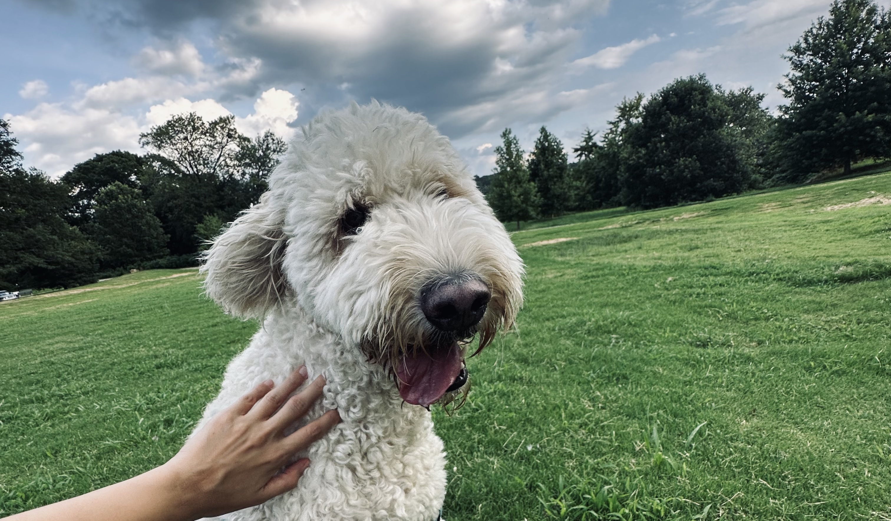

---

Waking up in the morning and applying sunscreen inevitably brings my dog running to me. Changing the sunscreen product makes no difference. To my dog, zinc oxide is the scent of morning walks. The smell of inorganic compounds is happiness to someone. The connection between inorganic compounds and the happiness of a particular animal being is not at all inevitable, but **meaning** is something that arises arbitrarily **through chance over time**.

My dog was born on January 31, 2021. He was unknowingly transported by a stranger (which is me) in a car to an unfamiliar place (which is my apartment) where he had to adapt. This situation has always made me feel a sense of guilt. Our relationship seemed somewhat unfair from the start. However, being a dog, he has an innate tendency to love his owner, which in this case, is me. I have constantly tried to balance this skewed relationship to make it less one-sided. He loves me more than anything, is always by my side, and even in moments that might justify resentment, he stands as my unwavering ally. Explaining what my dog means to me is challenging; our connection transcends simple words. When we look into each other's eyes and share our breaths, we experience a bond that goes beyond species. This bond cannot be fully articulated, nor can its depth be conveyed to others. (I hope I'm not seen as the crazy dog lady although it is true that I'm one.) The dog that came to me **by chance**, after being born in the Blue Ridge Mountains and becoming available due to someone's cancellation, **has become a companion-being in the course of time**.

Regrettably adopted by a Ph.D. student without a yard, I've always felt guilty, so I was diligent about our walks. Since puppyhood, my dog has been a real rascal. Tearing up the house, always wanting to run, and endlessly wanting to play, making putting the leash back on always a big fuss. Neighboring dog owners advised that dogs calm down after turning one. Anyway, I believe I did my best. Believing in a critical period in a dog's development, that puppies need to play and start understanding what's in the outside world, what smells there are, and how fun it is to chase squirrels, I wanted to make my dog's childhood as happy as possible.

Now, that grace period has passed from 'one year old' to 'two years old,' and today it turned three, but my dog is still a baby and a mischief-maker. My dog may not have become calmer, but I have become more active. A friend who raised a dog comforts me by saying their dog calmed down around five, but I hope my dog remains a mischief-maker for life. Always wanting to play, always wanting to go out, always wanting to run, is what I wish for my baby dog.
