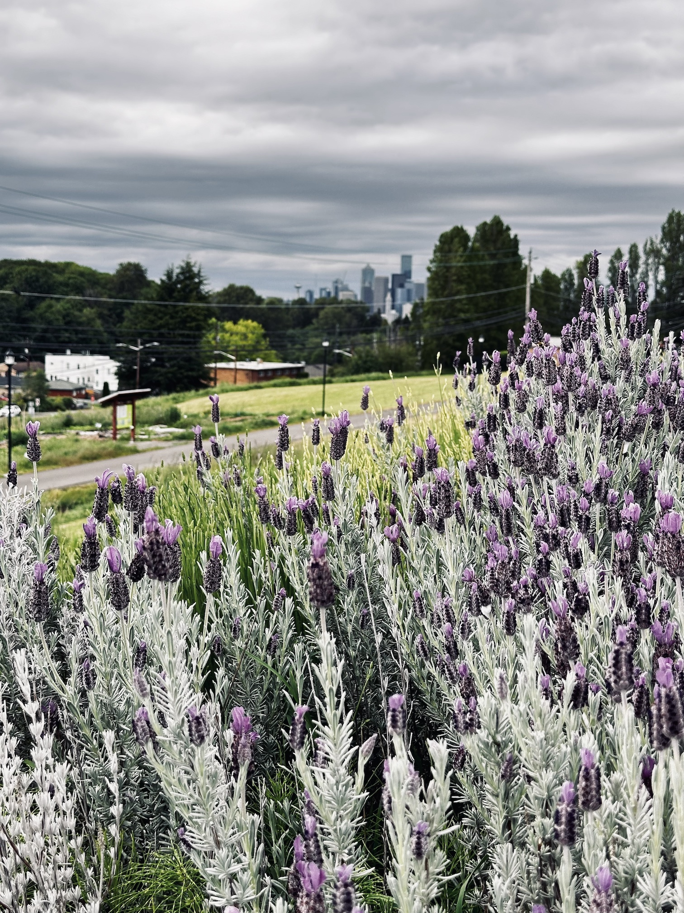

---

Sometimes, while driving, I encounter really annoying cars behind me, and I wish I could tell them they're doing something wrong. Some might ask how I could be annoyed by cars behind, not ahead. Well, I sometimes want to tell them don't drive too close behind me, or when I pass by a car just now to keep a distance from a reckless driver, and I happen to be in a bad mood.

The problem is I don't have the vocabulary for them, which is so frustrating. To cars behind, I can only say thank you (for letting me in to the lane), I am sorry (for my reckless mistake but it wasn't intentional), or be careful (because something is happening, or I cannot see the front due to weather) -- All perfectly polite. On the contrary, it is allowed to be immoderately mean to cars ahead. Honking often times comes across as really mean and rude, and some cars blind the vision of the drivers in the car ahead of them, which actually could cause undesirable incidents on road.

But why? It feels unfair to me. Is that the case that cars behind us are better people than cars ahead of us? What if I need to be a liiiiittle less nice with the cars behind me to give them a subtle warn? What then? Should I just embrace this helplessness as given? Whenever this happens I can relate myself with Ariel who loses her voice for love, merely to be unable to say I love you to her love. I want to say something slightly less kind just to boost the overall safety of the entire road for all fellow drivers, but I don't have the right voice for the purpose.

But please don't get me wrong, it's not like I want to scream obscenities. Probably what I want to say to them is could you maybe keep a safe distance between our cars, please? Thank you in advance.
