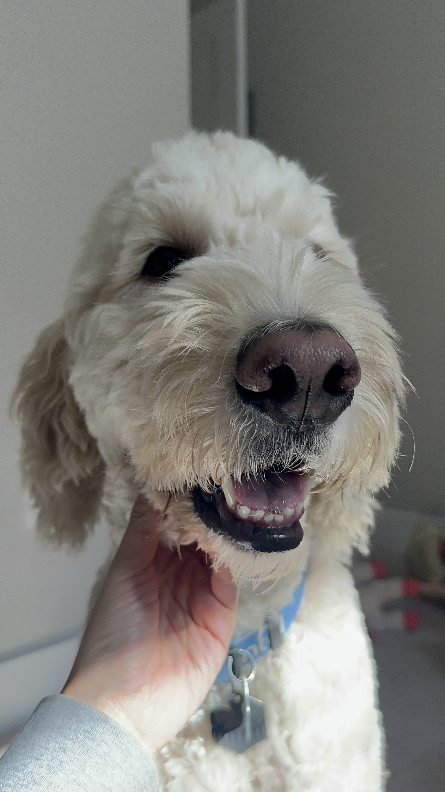

# However Unproductive I Was Today
---
No matter how unproductive I’ve been today, I always feel deeply fulfilled after using an interdental brush, flossing, and thoroughly brushing my teeth before bed. Brushing my teeth is just _so_ exciting. I honestly can't remember why I used to hate it as a kid.

A very important part of my dental care routine is brushing my dog's teeth. His snout is enormously long, yet his teeth are as tiny as Japonica rice grains. As I carefully clean each one, watching him patiently endure my vigorous scrubbing, I think to myself, this must be love. He probably has no idea why I’m doing this, and to him, it's probably more of a daily annoyance than an act of love. But since it’s his mom doing it, he puts up with it, and that makes me all the more grateful.

Today, my sweet dog turns four years old. Four whole years of being my family, thank you for sticking with me. Were you scared when some weird lady suddenly kidnapped you and brought you home? That lady says she’s incredibly happy to have you in her life. I hope you feel the same about her, too.
