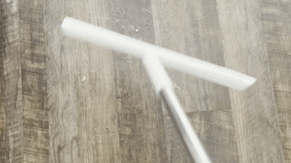

Lately, I've genuinely started enjoying house chores. First, I recently got the famous Scrub Daddy, whose texture changes with temperature. The sensation is oddly fascinating, which has made me do the dishes immediately by hand. Scrubbing stubborn stains and grime off pans empties my mind and brings me a sense of tranquility.

Secondly, after getting a dust squeegee, I started gathering dust from the floor into a single spot. With a dog at home, there is always a ton of dust on the floor. As I collect the dust, I think to myself, the squeegee feels like a Zen garden eraser, tracing ephemeral patterns before wiping them away. This is the Zen garden for a poor woman. With each stroke of the squeegee, I draw fleeting patterns in the dust, only to erase them again. With this squeegee, someone like me, who have neither the time nor money to visit Japan, can clear both mind and home.

Doing chores mindfully exhausted me so I wanted a bubble bath. However, expensive bath bombs are a luxury that I can't afford, so with my minimal physical strength, vigorously whisked the water instead, as hard as I could. My arms almost fell off from stirring and bubbles were still meager and paltry. But I still feel grateful for having a bathtub to soak in.
